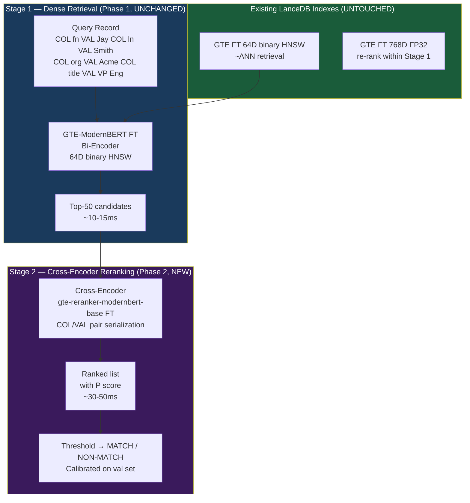
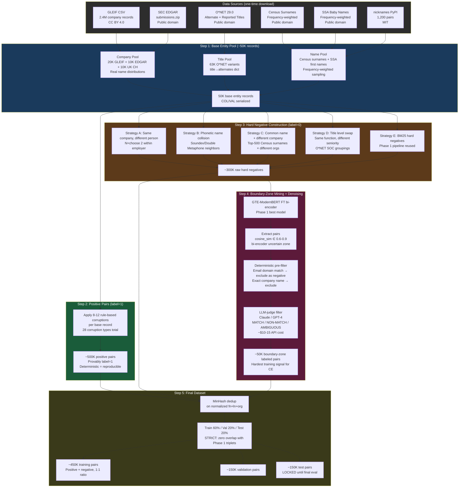

# Entity Resolution POC — Phase 2 Plan
## Cross-Encoder Reranking on Top of Fine-Tuned Dense Retrieval

**Author:** Jay Shah  
**Date:** 2026-03-15  
**Status:** Planning  
**Branch:** `phase2`  
**Depends on:** Phase 1 complete (all models fine-tuned, all eval done, blog published)

---

## 1. Executive Summary

Phase 1 proved that a fine-tuned bi-encoder (GTE-ModernBERT, 149M) beats BM25 on the hardest corruption bucket (`missing_email_company`: +10.2pp R@10). BM25 remains at 1.000 R@10 on five of six buckets — dense retrieval doesn't improve easy cases.

Phase 2 adds a **cross-encoder reranker** above the existing Stage 1 retrieval. The reranker sees both records simultaneously, enabling cross-field attention that cosine similarity cannot replicate. This is a precision play — the bi-encoder already has good recall; the reranker sharpens the top of the ranked list.

**What changes:** one new stage above existing indexes. The LanceDB indexes are untouched.

**What doesn't change:** data generation for the base entity pool, existing eval buckets, existing indexes, existing Model training infra on Modal.

---

## 2. Phase 1 State (What We Have)

```
Results (all ✅):
  R@10 overall:
    BM25                     0.958  (MRR 0.917)  — 1.000 on 5/6 buckets
    GTE-ModernBERT ZS        0.941
    GTE-ModernBERT FT (best) 0.975  (768D INT8)
    MiniLM-L6 FT 128D INT8   0.934  — Pareto winner: <7ms, <700MB
    Nomic FT                 0.817  — catastrophic forgetting confirmed
    BGE-small FT             0.932

  Hardest bucket (missing_email_company):
    BM25                     0.750
    GTE-ModernBERT FT        0.852  (+10.2pp)

  Training cost: <$15 on Modal for all 5 models in parallel

Published:
  Blog post:   writing/BLOG_POST.md
  Paper draft: writing/paper.md
  HF models:   jayshah5696/er-{model}-pipe-ft (5 models)
  HF dataset:  jayshah5696/entity-resolution-triplets
```

**Phase 1 conclusion:** fine-tuned dense retrieval improves recall on hard cases. The gap in ordering precision — especially on cross-field semantic matches — remains. That is Phase 2's target.

---

## 3. Phase 2 Research Hypotheses

| ID | Hypothesis | Success criterion |
|---|---|---|
| H5 | Fine-tuned CE reranker improves nDCG@10 over bi-encoder alone | +3pp nDCG@10 on ≥2 corruption buckets |
| H6 | BM25 + CE reranker cannot match Dense FT + CE FT on `missing_email_company` | Dense FT + CE FT > BM25 + CE by ≥10pp R@10 on that bucket |
| H7 | GTE-reranker (same backbone as bi-encoder) outperforms MiniLM reranker after fine-tuning | GTE-reranker FT > MiniLM-reranker ZS by ≥5pp nDCG@10 |
| H8 | COL/VAL serialization in CE input improves F1 over pipe format | COL/VAL F1 > pipe F1 by ≥2pp |

---

## 4. Architecture Overview



**Key constraint:** The cross-encoder runs only on Stage 1's top-50. It never touches the 500M record pool. Latency budget: Stage 1 ~15ms + Stage 2 ~50ms = ~65ms end-to-end.

---

## 5. Models Roster

**Design constraints:**
- Apache-2.0 or MIT license only
- ≤200M parameters (fits A10G VRAM comfortably, no OOM risk in training)
- No LLM-based rerankers (Qwen3-Reranker, rank_zephyr) — too slow for production
- No Gemma license (eliminates bge-reranker-v2.5-gemma2-lightweight)
- No CC-BY-NC (eliminates Jina rerankers)

### Cross-Encoder Model Roster

| model_key | HF Model ID | License | Params | BEIR nDCG@10 | Context | Role |
|---|---|---|---|---|---|---|
| `minilm_reranker` | `cross-encoder/ms-marco-MiniLM-L12-v2` | Apache-2.0 | 33M | ~50 | 512 | **Latency baseline** — zero-shot only |
| `gte_reranker` | `Alibaba-NLP/gte-reranker-modernbert-base` | Apache-2.0 | 149M | 56.2 | 8192 | **Primary fine-tune target** |
| `bge_reranker_m3` | `BAAI/bge-reranker-v2-m3` | Apache-2.0 | 570M | 55.4 | 8192 | **Zero-shot ceiling** — no fine-tune (too large for M3) |
| `granite_reranker` | `ibm-granite/granite-embedding-reranker-english-r2` | Apache-2.0 | 149M | 55.8 | 8192 | **Fine-tune candidate** — enterprise-clean data provenance |

**Why these four and not others:**
- `bge-reranker-base` (MIT, 278M): superseded by bge-reranker-v2-m3 in accuracy; 278M is heavier without gains. Cut.
- `bge-reranker-large` (MIT, 560M): same issues as above at larger size. Cut.
- `Qwen3-Reranker-0.6B` (Apache-2.0): LLM-based yes/no logit. 60x more expensive inference than CE, 48x slower per Voyage AI study. Cut for production use; acceptable as an eval reference ceiling but not a deployment option.
- `jhu-clsp/rank1-*` (MIT): reasoning reranker — interesting but GPT-4-level cost at inference. Cut.

**Fine-tune targets (Modal training):** `gte_reranker`, `granite_reranker`  
**Zero-shot references (no training):** `minilm_reranker`, `bge_reranker_m3`

**configs/crossencoder_models.yaml** (to be created):
```yaml
# LOCKED MODEL REGISTRY — Phase 2 Cross-Encoders
# DO NOT ADD MODELS without updating this header date
# Lock date: 2026-03-15

models:
  minilm_reranker:
    hf_id: cross-encoder/ms-marco-MiniLM-L12-v2
    params: 33M
    license: apache-2.0
    context: 512
    finetune: false
    note: "latency baseline; already MS MARCO trained"

  gte_reranker:
    hf_id: Alibaba-NLP/gte-reranker-modernbert-base
    params: 149M
    license: apache-2.0
    context: 8192
    finetune: true
    note: "primary; same ModernBERT backbone as Phase 1 bi-encoder"

  bge_reranker_m3:
    hf_id: BAAI/bge-reranker-v2-m3
    params: 570M
    license: apache-2.0
    context: 8192
    finetune: false
    note: "zero-shot ceiling; too large for M3 fine-tuning"

  granite_reranker:
    hf_id: ibm-granite/granite-embedding-reranker-english-r2
    params: 149M
    license: apache-2.0
    context: 8192
    finetune: true
    note: "trained only on permissive-license data; enterprise-safe"

finetune_targets:
  - gte_reranker
  - granite_reranker

hf_model_prefix: jayshah5696/er-ce
```

---

## 6. Dataset Pipeline — Option B (Real Data + Rule-Based Corruption)

### Why Option B, not Faker

Phase 1 used `faker.Faker()`. This is fine for bootstrapping but has three problems for cross-encoder training:
1. Company names don't follow real distributions (Faker outputs "Harrell and Sons"; real CRM has "Goldman Sachs Group, Inc.")
2. Name frequencies are flat-uniform (Smith is 5x more common than Zilinski in reality)
3. Hard negatives are too easy — a cross-encoder trained on Faker-level differences won't generalize to real edge cases

Option B uses real open-government data sources with deterministic corruption. Labels are **provably correct** — no LLM verification needed for positive pairs. Hard negatives require a mining step (below).

### Data Sources

| Source | Data | Scale | License | Download |
|---|---|---|---|---|
| GLEIF Golden Copy | Company legal names + OtherEntityNames (aliases) | 2.4M records | CC BY 4.0 | gleif.org/en/lei-data/gleif-golden-copy |
| SEC EDGAR | US company names + formerNames (rebrand pairs) | 800K CIKs | Public domain | data.sec.gov/submissions.zip |
| O*NET 29.0 | Job titles: 27,912 alternate + 35,479 reported | ~63K titles | Public domain | onetcenter.org/dl_files/database/db_29_0_text.zip |
| US Census 2010 | 162,254 surnames with frequency counts | 162K | Public domain | census.gov/topics/genealogy/data/2010_surnames.html |
| SSA Baby Names | ~100K first names with frequency by year | 100K | Public domain | ssa.gov/oact/babynames/names.zip |
| nicknames PyPI | 1,200 first name → nickname mappings | 1.2K | MIT | `pip install nicknames` |
| cleanco PyPI | Legal suffix normalization (60+ countries) | reference | MIT | `pip install cleanco` |

### Dataset Pipeline Architecture



### Positive Corruption Taxonomy (28 types, all label=1)

**Company corruptions:**

| Code | Name | Example | Implementation |
|---|---|---|---|
| C1 | legal_suffix_swap | "Acme LLC" → "Acme Ltd" / "Acme Inc" / "Acme" | cleanco suffix list |
| C2 | suffix_drop | "Microsoft Corporation" → "Microsoft" | cleanco.basename() |
| C3 | the_prefix_drop | "The Home Depot" → "Home Depot" | strip leading "The " |
| C4 | ampersand_normalize | "Johnson & Johnson" → "Johnson and Johnson" | str.replace |
| C5 | company_abbreviation | "International Business Machines" → "IBM" | GLEIF OtherEntityNames |
| C6 | word_truncation | "Goldman Sachs Group" → "Goldman Sachs" | drop last token |
| C7 | rebrand | "Facebook" → "Meta Platforms" | EDGAR formerNames |
| C8 | shorten_name | "Acme International Holdings Ltd" → "Acme Intl" | abbrev + drop suffix |

**Name corruptions:**

| Code | Name | Example | Implementation |
|---|---|---|---|
| N1 | diacritic_strip | "García" → "Garcia" | unicodedata.normalize NFD |
| N2 | single_char_delete | "Microsoft" → "Microsft" | random position delete |
| N3 | keyboard_sub | "Smith" → "Smkth" (i→k, QWERTY adjacent) | QWERTY_NEIGHBORS dict |
| N4 | ocr_sub | "0" → "O", "1" → "I", "rn" → "m" | OCR_PAIRS lookup |
| N5 | char_transposition | "Smith" → "Smiht" | swap adjacent chars |
| N6 | name_swap | "Jay Smith" → "Smith Jay" | swap fn↔ln tokens |
| N7 | first_initial | "Jay Smith" → "J. Smith" | fn[0] + "." |
| N8 | first_middle_initial | "Jay Michael Smith" → "J. M. Smith" | both initials |
| N9 | drop_middle | "Jay Michael Smith" → "Jay Smith" | remove middle token |
| N10 | middle_initial | "Jay Michael Smith" → "Jay M. Smith" | middle[0] + "." |
| N11 | last_initial | "Jay Smith" → "Jay S." | ln[0] + "." |
| N12 | nickname | "William" → "Bill" | nicknames.NickNamer() |
| N13 | phonetic_sub | "ph"→"f", "ck"→"k", "ce"→"se" | PHONETIC_PAIRS dict |

**Title corruptions:**

| Code | Name | Example | Implementation |
|---|---|---|---|
| T1 | title_abbreviation | "Vice President of Engineering" → "VP Engineering" | O*NET alternate titles |
| T2 | title_expansion | "VP" → "Vice President" | O*NET reverse lookup |
| T3 | title_reorder | "Engineering VP" → "VP Engineering" | token sort |
| T4 | seniority_drop | "Senior Software Engineer" → "Software Engineer" | strip Sr./Senior/Staff prefix |
| T5 | seniority_synonym | "Sr." → "Senior" → "Sr" | SENIORITY_MAP dict |
| T6 | missing_field | "VP Engineering" → "" | field null |

**Email corruptions:**

| Code | Name | Example | Implementation |
|---|---|---|---|
| E1 | email_format_variant | "jay.smith@acme.com" → "j.smith@acme.com" | format pattern change |
| E2 | domain_swap | "jay@acme.com" → "jay@gmail.com" | personal domain substitution |

**Negative construction (label=0, provably different entity):**

| Code | Strategy | Construction | Label guarantee |
|---|---|---|---|
| NEG1 | same_company_diff_person | Different name, same org | Different entity_id |
| NEG2 | phonetic_name_neighbor | Soundex/DoubleMetaphone neighbor, different org | Different base record |
| NEG3 | common_name_diff_company | Top-500 Census surname, different org | Different base record |
| NEG4 | title_function_swap | Same seniority, different O*NET function | Different role |
| NEG5 | title_level_swap | Same function, different seniority (VP vs Director) | Different level |
| NEG6 | random_negative | Random draw from pool | Different entity_id |
| NEG7 | boundary_zone_nonmatch | cosine_sim ∈ [0.6, 0.9], LLM-verified NON-MATCH | LLM verified |

**Ambiguous — EXCLUDE from training:**
- CTO vs VP Engineering at <20-person company
- Same person, different role (job change — needs temporal context unavailable in static snapshot)
- Parent/subsidiary pairs (Facebook vs Meta before rebrand — ambiguous identity)

### Serialization Format

All cross-encoder input uses **COL/VAL format** (Ditto-style, VLDB 2021). This replaces Phase 1's pipe format for CE input only. The bi-encoder still uses pipe.

```
# Phase 1 (bi-encoder, pipe format — UNCHANGED):
"Jay Smith | Acme Inc | jay.smith@acme.com | VP Engineering | USA"

# Phase 2 (cross-encoder input, COL/VAL format):
"[CLS] COL fn VAL Jay COL ln VAL Smith COL org VAL Acme Inc COL title VAL VP Engineering COL country VAL USA [SEP] COL fn VAL J. COL ln VAL Smith COL org VAL Acme COL title VAL Vice President Engineering COL country VAL USA [SEP]"
```

---

## 7. Training Plan

### Modal Training Setup

Same infrastructure as Phase 1. Use `finetune_ce_modal.py` (new script, mirrors `finetune_modal.py` structure).

```
GPU:      A10G (sufficient for 149M cross-encoders)
Timeout:  120 min per model (CE training is faster than bi-encoder)
Volume:   entity-resolution-ce-checkpoints
Image:    same as Phase 1 (Python 3.11, torch 2.6.0 cu124, ST>=5.0,<6, transformers==4.57.6)
```

### Loss Schedule

Cross-encoders are trained as binary classifiers with one scalar output head:

**BCE Phase (Epochs 1-3):**
```python
# sentence-transformers v5 CrossEncoderTrainer
# Input: (record_a, record_b, label) where label ∈ {0, 1}
loss = CrossEncoderRankingLoss(model)  # BinaryCrossEntropyLoss variant
```

**LambdaLoss Phase (Epochs 4-5):**
```python
# Switch to listwise-approximating ranking loss
# Directly optimizes NDCG — extracts ranking quality BCE doesn't see
loss = CrossEncoderRankingLoss(model, loss_fct="lambda")
```

### Negative Curriculum

Mirrors Phase 1 pattern:

| Epoch | Hard neg % | Random neg % |
|---|---|---|
| 1 | 20% | 80% |
| 2 | 40% | 60% |
| 3 | 60% | 40% |
| 4 | 80% | 20% |
| 5 | 80% | 20% |

Hard negatives = boundary-zone pairs mined from bi-encoder + NEG1-NEG7 strategies.  
Random negatives = random draws from pool (not all useless — they set the floor).

### Hard Negative Pre-filtering

Before any pair enters training, apply this filter:

```python
# SBERT MS MARCO convention: hard neg must be at least 3 score points below positive
# Using stock gte-reranker-modernbert-base (zero-shot) for this pre-filter pass
ce_score_pos = stock_ce.predict([(query, positive)])
ce_score_neg = stock_ce.predict([(query, negative)])

if ce_score_neg >= ce_score_pos - 3.0:
    # This is likely a false negative — exclude
    skip()
```

### Hyperparameters

```yaml
# configs/crossencoder.yaml
training:
  batch_size: 64          # smaller than bi-encoder due to pair-based CE memory
  epochs: 5
  lr: 2e-5
  warmup_steps: 200       # not warmup_ratio (deprecated in ST 3.4+)
  weight_decay: 0.01
  max_length: 512         # records are short; 512 sufficient, saves VRAM
  fp16: false             # MPS local dev
  bf16: true              # Modal (A10G)

eval:
  strategy: steps
  eval_steps: 500
  save_steps: 500
  load_best_model_at_end: true
  metric_for_best: ndcg_at_10

hf_push:
  prefix: jayshah5696/er-ce
  # Final model IDs:
  # jayshah5696/er-ce-gte-reranker-ft
  # jayshah5696/er-ce-granite-reranker-ft
```

---

## 8. Evaluation Protocol

### Existing Indexes (Stage 1 — UNCHANGED)

Phase 2 uses the **GTE-ModernBERT fine-tuned** index as Stage 1 retrieval. No re-indexing:

```
experiments/
  001_bm25_baseline/          — BM25 index (pkl)
  007_ablation_dims/
    indexes/
      gte_modernbert_base_pipe_ft_fp32/  ← Stage 1 primary
      gte_modernbert_base_pipe_ft_int8/  ← Stage 1 quantized variant
```

### New Eval Script: `run_reranker.py`

Wraps Stage 1 results + Stage 2 reranking. CLI:

```bash
python src/eval/run_reranker.py \
  --stage1-model gte_modernbert_base \
  --stage1-index experiments/007_ablation_dims/indexes/gte_modernbert_base_pipe_ft_fp32 \
  --reranker gte_reranker \
  --reranker-model-path jayshah5696/er-ce-gte-reranker-ft \
  --eval-queries data/eval/ \
  --top-k-stage1 50 \
  --output results/008_gte_ft_plus_ce_ft.json \
  --experiment-id 008
```

Output JSON follows **ADR-003 schema** exactly, adding:
```json
{
  "stage2_reranker": "gte_reranker",
  "stage2_mode": "fine_tuned",
  "stage2_top_k_input": 50,
  "stage2_latency_ms": {"p50": 0, "p95": 0, "p99": 0},
  "threshold_f1": 0.0,
  "pr_curve": [[precision, recall, threshold], ...]
}
```

### Full Comparison Matrix

8 systems to benchmark. Each run on all 6 corruption buckets:

| Exp ID | System | Stage 1 | Stage 2 | What it proves |
|---|---|---|---|---|
| 001 | BM25 | BM25 | — | Floor (Phase 1 done ✅) |
| — | GTE FT | Dense FT | — | Phase 1 winner (done ✅) |
| 008 | BM25 + MiniLM ZS | BM25 | minilm_reranker ZS | Classic industry hybrid |
| 009 | BM25 + GTE CE FT | BM25 | gte_reranker FT | Best reranker, limited by BM25 recall ceiling |
| 010 | GTE FT + MiniLM ZS | Dense FT | minilm_reranker ZS | Fast reranking reference |
| 011 | GTE FT + GTE CE ZS | Dense FT | gte_reranker ZS | Zero-shot reranking delta |
| 012 | GTE FT + GTE CE FT | Dense FT | gte_reranker FT | **Main Phase 2 result** |
| 013 | GTE FT + Granite FT | Dense FT | granite_reranker FT | Enterprise-clean comparison |
| 014 | GTE FT + BGE-M3 ZS | Dense FT | bge_reranker_m3 ZS | Quality ceiling (570M ZS) |

### Metrics to Report

**Carry forward from Phase 1:**
- `recall_at_k` (k=1, 5, 10) per bucket
- `mrr_at_k` (k=10) per bucket
- `ndcg_at_k` (k=10) per bucket
- `p50/p95/p99` latency (Stage 2 specifically, separate from Stage 1)

**New Phase 2 metrics:**
- `f1_at_threshold` — binary match decision at calibrated threshold (reported on val set)
- `precision_recall_curve` — full sweep saved as JSON array `[[p, r, t], ...]`
- `recall_retention` — % of queries where true match stays in top-10 after reranking (should be ~100%; this is the sanity check that the reranker never "loses" the correct answer)
- `stage2_latency_ms` — CE inference time only, separate from Stage 1

### Bucket Results Table Template

Per experiment, fill this table in `report_phase2.md`:

| Bucket | BM25 R@10 | GTE FT R@10 | GTE FT + CE FT R@10 | GTE FT + CE FT nDCG@10 | GTE FT + CE FT F1 |
|---|---|---|---|---|---|
| pristine | 1.000 | — | — | — | — |
| missing_firstname | 1.000 | — | — | — | — |
| missing_email_company | 0.750 | 0.852 | — | — | — |
| typo_name | 1.000 | — | — | — | — |
| domain_mismatch | 1.000 | — | — | — | — |
| swapped_attrs | 1.000 | — | — | — | — |

---

## 9. Test-Driven Development (TDD)

### Test Strategy

Follow same pattern as Phase 1. Write tests **before** implementation. Tests live in `tests/`. Run with `pytest tests/ -q` before any PR or push.

**Coverage expectations:**
- Data pipeline: 90%+ (deterministic → easy to test)
- Corruption functions: 100% (each corruption type has a unit test)
- CE inference wrapper: 80%+
- Eval pipeline: 70%+ (integration tests cover the rest)

### Test File Map

```
tests/
  data/
    test_sources.py          ← validates GLEIF/EDGAR/ONET download + parse
    test_base_pool.py        ← entity pool generation, frequency weighting
    test_corrupt_phase2.py   ← all 28 positive corruptions (unit tests per type)
    test_negatives.py        ← all 7 negative strategies, label validity
    test_split.py            ← train/val/test split, no-overlap guarantee
    test_dedup.py            ← MinHash dedup, near-duplicate detection
  models/
    test_crossencoder.py     ← CE loading, inference shape, score range [0,1]
    test_serializer.py       ← COL/VAL format, field ordering, truncation
    test_ce_filter.py        ← hard negative pre-filter (3-point threshold)
  eval/
    test_run_reranker.py     ← integration: Stage1 → Stage2 → metrics
    test_metrics_phase2.py   ← F1@threshold, PR curve, recall_retention
  configs/
    test_config_phase2.py    ← validates crossencoder.yaml schema
```

### Key Unit Tests (Non-Negotiable)

```python
# tests/data/test_corrupt_phase2.py

def test_keyboard_sub_uses_qwerty_neighbors():
    """N3 must only substitute with adjacent QWERTY keys."""
    result = corrupt_keyboard("smith")
    for i, (orig, new) in enumerate(zip("smith", result)):
        if orig != new:
            assert new in QWERTY_NEIGHBORS[orig], \
                f"Position {i}: {orig!r}→{new!r} is not a QWERTY neighbor"

def test_positive_pair_text_differs():
    """Positive pair pipe text must differ from anchor."""
    for corruption_type in ALL_CORRUPTION_TYPES:
        anchor = make_test_record()
        positive = corrupt_record(anchor, [corruption_type])
        assert serialize_pipe(anchor) != serialize_pipe(positive), \
            f"{corruption_type} produced identical text"

def test_negative_different_entity_id():
    """All negative construction strategies must produce different entity_id."""
    pool = make_test_pool(n=100)
    for strategy in [NEG1, NEG2, NEG3, NEG4, NEG5, NEG6]:
        anchor = pool[0]
        negative = strategy(anchor, pool)
        assert negative["entity_id"] != anchor["entity_id"], \
            f"{strategy} returned same entity as anchor"

# tests/data/test_split.py

def test_no_entity_id_overlap_with_phase1():
    """Phase 2 entity pool must not share entity_ids with Phase 1 triplets."""
    phase1_ids = load_phase1_entity_ids()  # from data/triplets/triplets.parquet
    phase2_ids = load_phase2_entity_ids()  # from data/phase2/base_pool.parquet
    overlap = phase1_ids & phase2_ids
    assert len(overlap) == 0, f"Found {len(overlap)} overlapping entity IDs"

def test_test_split_never_seen_in_training():
    """Test set entity IDs must not appear in train or val splits."""
    train_ids = set(train_df["anchor_id"]) | set(train_df["candidate_id"])
    test_ids = set(test_df["anchor_id"]) | set(test_df["candidate_id"])
    assert len(train_ids & test_ids) == 0

# tests/eval/test_metrics_phase2.py

def test_recall_retention_never_drops_true_match():
    """Reranker must never push the true match out of top-10."""
    # Create synthetic Stage1 results where true match is always in top-50
    results = run_reranker_on_synthetic(true_match_rank_in_stage1=3)
    assert results["recall_retention"] == 1.0

def test_f1_calibration_on_val_set():
    """Calibrated threshold must give F1 > 0.80 on val set."""
    val_results = run_reranker_on_val()
    assert val_results["f1_at_threshold"] >= 0.80
```

---

## 10. New File Structure

### Branch: `phase2`

Changes from Phase 1 state:

```
entity-resolution-poc/
├── AGENTS.md                          ← NEW: AI assistant instructions
├── configs/
│   ├── crossencoder_models.yaml       ← NEW: CE model registry (4 models)
│   └── crossencoder.yaml              ← NEW: training hyperparameters
├── data/
│   └── phase2/                        ← NEW: all Phase 2 data lives here
│       ├── raw/                       ← downloaded source files (gitignored)
│       │   ├── gleif_golden_copy.csv
│       │   ├── onet_alternate_titles.txt
│       │   ├── census_surnames.csv
│       │   └── ssa_names.zip
│       ├── base_pool.parquet          ← 50K base entity records (gitignored)
│       ├── ce_train.parquet           ← 450K training pairs (gitignored)
│       ├── ce_val.parquet             ← 150K val pairs (gitignored)
│       └── ce_test.parquet            ← 150K test pairs (LOCKED, gitignored)
├── docs/
│   └── PHASE2_UNDERSTANDING.md        ← NEW: same role as UNDERSTANDING.md
├── src/
│   ├── data/
│   │   ├── phase2_sources.py          ← NEW: download + parse GLEIF/EDGAR/ONET
│   │   ├── phase2_pool.py             ← NEW: build 50K base entity pool
│   │   ├── phase2_corrupt.py          ← NEW: 28 positive + 7 negative types
│   │   ├── phase2_negatives.py        ← NEW: 5 negative strategies + mining
│   │   ├── phase2_boundary.py         ← NEW: bi-encoder boundary-zone mining
│   │   └── phase2_split.py            ← NEW: deterministic split + dedup
│   ├── models/
│   │   ├── crossencoder.py            ← NEW: CE inference wrapper
│   │   └── finetune_ce_modal.py       ← NEW: Modal training (mirrors finetune_modal.py)
│   └── eval/
│       ├── run_reranker.py            ← NEW: Stage1 + Stage2 pipeline
│       └── metrics_phase2.py          ← NEW: F1, PR curve, recall_retention
├── experiments/
│   ├── 008_bm25_plus_minilm_reranker/ ← NEW
│   ├── 009_bm25_plus_gte_ce_ft/       ← NEW
│   ├── 010_gte_ft_plus_minilm_zs/     ← NEW
│   ├── 011_gte_ft_plus_gte_ce_zs/     ← NEW
│   ├── 012_gte_ft_plus_gte_ce_ft/     ← NEW (Main Phase 2 result)
│   ├── 013_gte_ft_plus_granite_ft/    ← NEW
│   └── 014_gte_ft_plus_bge_m3_zs/     ← NEW
├── tests/
│   ├── data/
│   │   ├── test_sources.py            ← NEW
│   │   ├── test_corrupt_phase2.py     ← NEW
│   │   ├── test_negatives.py          ← NEW
│   │   ├── test_split.py              ← NEW
│   │   └── test_dedup.py              ← NEW
│   ├── models/
│   │   ├── test_crossencoder.py       ← NEW
│   │   └── test_serializer.py         ← NEW
│   └── eval/
│       ├── test_run_reranker.py       ← NEW
│       └── test_metrics_phase2.py     ← NEW
└── writing/
    ├── BLOG_POST_PHASE2.md            ← NEW (placeholder until results)
    └── PAPER_PHASE2_ADDENDUM.md       ← NEW (methodology + results sections)
```

### Key: What Is NOT Changed

These files are **frozen** in Phase 2. Phase 2 engineers should not touch:
```
configs/models.yaml          — Phase 1 model registry
configs/eval.yaml            — Phase 1 eval config
src/data/generate.py         — Phase 1 profile generator
src/data/triplets.py         — Phase 1 triplet generator
src/data/corrupt.py          — Phase 1 corruption functions
src/models/finetune_modal.py — Phase 1 Modal training
src/eval/build_index.py      — Phase 1 index builder
src/eval/run_eval.py         — Phase 1 dense eval
src/eval/run_bm25.py         — Phase 1 BM25 eval
experiments/001-007/         — Phase 1 results (read-only)
data/raw/, data/processed/,
data/triplets/, data/eval/   — Phase 1 data (read-only)
```

---

## 11. Implementation Checklist

Ordered. Each step has a clear completion test. An engineer can pick up from any step.

### Step 0: Branch + AGENTS.md (30 min)

- [ ] `git checkout -b phase2` from main (tag main first as `v1.0-phase1`)
- [ ] Create `AGENTS.md` at repo root (see Section 14)
- [ ] Update `README.md`: add Phase 2 section above Phase 1 results, status "In Progress"
- [ ] Create empty directory structure for all new paths above
- [ ] `git commit -m "chore: branch phase2, add AGENTS.md, scaffold phase2 structure"`

**Done when:** `git log --oneline -5` shows the commit. `cat AGENTS.md` returns content.

---

### Step 1: Config Files (1 hour)

- [ ] Create `configs/crossencoder_models.yaml` (see Section 5)
- [ ] Create `configs/crossencoder.yaml` (see Section 7)
- [ ] Create `tests/configs/test_config_phase2.py`:
  - Validate crossencoder_models.yaml loads without error
  - Assert all 4 model keys present
  - Assert only 2 finetune_targets
  - Assert all required fields per model
- [ ] Run `pytest tests/configs/test_config_phase2.py -v` — must pass

**Done when:** all config tests pass.

---

### Step 2: Data Source Download + Parse (1-2 days)

**TDD first** — write `tests/data/test_sources.py` before any source code.

Tests to write:
```python
test_gleif_csv_loads()            # smoke: file exists, >1M rows, has LegalName column
test_gleif_other_names_array()    # OtherEntityNames is parseable JSON array
test_onet_alternate_titles()      # >27K rows, has O*NET-SOC Code + Alternate Title columns
test_census_surnames_weighted()   # 162K rows, has name + count, Smith is rank 1
test_ssa_names_weighted()         # >100K unique names across years, has count column
test_nicknames_lookup()           # William → {Bill, Will, Billy, Liam}
```

Then implement `src/data/phase2_sources.py`:
- `download_gleif(output_dir)` — fetch, unzip, return path
- `parse_gleif(path)` → polars DataFrame with columns: `legal_name, other_names_list, country, legal_form, status`
- `download_onet(output_dir)` — fetch zip, extract two files
- `parse_onet_alternates(path)` → dict `{canonical_title: [alt1, alt2, ...]}`
- `parse_onet_reported(path)` → list of real job titles (35K)
- `load_census_surnames(path)` → polars DataFrame with `name, count`
- `load_ssa_names(path, min_year=1970)` → polars DataFrame with `name, sex, count` (aggregated)
- `load_nicknames()` → dict `{formal_name: set(nicknames)}`

**Done when:** all `test_sources.py` tests pass. `python src/data/phase2_sources.py --output data/phase2/raw/` downloads all files without error.

---

### Step 3: Base Entity Pool (1 day)

**TDD first** — write `tests/data/test_base_pool.py`:
```python
test_pool_size_50k()              # exactly 50K records
test_name_frequency_weighted()    # Smith appears ~5x more than Zilinski
test_company_real_distribution()  # "LLC" suffix in ~35% of US companies (GLEIF stat)
test_title_onet_coverage()        # all titles in pool appear in O*NET alternate titles
test_no_email_duplicates()        # every email unique
test_entity_id_unique()           # UUID4, no collisions
test_no_phase1_overlap()          # entity_ids not in Phase 1 triplets.parquet
test_country_distribution()       # ~60% USA, ~10% UK, others (matches dataset.yaml)
```

Then implement `src/data/phase2_pool.py`:
- `build_company_pool()` → 40K real company records from GLEIF + EDGAR + UK CH
- `build_title_pool()` → O*NET title variants dict
- `build_name_pool()` → Census-weighted surnames + SSA-weighted first names
- `assemble_base_pool(n=50_000)` → combine into entity records with realistic email patterns
- `save_base_pool(pool, output_path)` → parquet + stats.json

Record schema:
```python
{
    "entity_id": str,      # UUID4
    "first_name": str,
    "last_name": str,
    "middle_name": str,    # nullable, ~20% have one
    "company": str,        # from GLEIF/EDGAR real names
    "title": str,          # from O*NET reported titles
    "email": str,          # realistic pattern (60% firstname.lastname@co.com)
    "country": str,
    "company_legal_form": str,  # LLC, Inc, Ltd, GmbH etc
    "company_canonical": str,   # disambiguated company key
}
```

**Done when:** all `test_base_pool.py` tests pass. `data/phase2/base_pool.parquet` exists with 50K rows.

---

### Step 4: Corruption Functions (1-2 days)

This is the most important step. **Every corruption type needs a test.**

**TDD first** — write `tests/data/test_corrupt_phase2.py` with one test per corruption type (28 positive + 7 negative). Key tests listed in Section 9.

Then implement `src/data/phase2_corrupt.py`:
- One function per corruption type: `corrupt_c1_suffix_swap()`, `corrupt_n3_keyboard_sub()` etc.
- `QWERTY_NEIGHBORS: dict[str, str]` constant
- `OCR_PAIRS: list[tuple[str, str]]` constant
- `PHONETIC_PAIRS: list[tuple[str, str]]` constant
- `corrupt_record_phase2(record, corruption_codes)` — applies list of codes
- `colval_serialize(record)` — produces COL/VAL string for CE input
- `corrupt_for_bucket_phase2(bucket_name)` — maps bucket → corruption code(s), matches Phase 1 bucket semantics

Critical: `corrupt_for_bucket_phase2` must produce the same 6 eval buckets as Phase 1 for apples-to-apples comparison:
```python
BUCKET_MAP = {
    "pristine": [],
    "missing_firstname": ["N_missing_fn"],
    "missing_email_company": ["E_drop", "C_drop"],
    "typo_name": ["N3"],     # keyboard sub on name
    "domain_mismatch": ["E2"],
    "swapped_attributes": ["N6"],  # name swap fn↔ln
}
```

**Done when:** `pytest tests/data/test_corrupt_phase2.py -v` — all 28+ tests pass. Zero assertions on `corrupt_for_bucket_phase2` may fail (these gate eval validity).

---

### Step 5: Negative Mining (1 day)

**TDD first** — write `tests/data/test_negatives.py`. Every strategy must prove label=0.

Implement `src/data/phase2_negatives.py`:
- `mine_same_company_diff_person(pool)` → Strategy NEG1
- `mine_phonetic_neighbors(pool, algorithm="double_metaphone")` → Strategy NEG2 (use `doublemetaphone` PyPI)
- `mine_common_name_diff_company(pool, top_n=500)` → Strategy NEG3
- `mine_title_function_swap(pool, onet_groups)` → Strategy NEG4
- `mine_title_level_swap(pool)` → Strategy NEG5
- `mine_random(pool)` → Strategy NEG6

Implement `src/data/phase2_boundary.py`:
- `load_phase1_biencoder()` → loads `jayshah5696/er-gte-modernbert-base-pipe-ft`
- `encode_pool(pool, model, batch_size=512)` → numpy array of embeddings
- `find_boundary_pairs(embeddings, pool, low=0.6, high=0.9, n_pairs=50_000)` → candidate pairs
- `deterministic_filter(pairs)` → remove pairs where email domain or normalized company exactly matches (safety check before LLM)
- `llm_judge_batch(pairs, model="claude-3-7-sonnet", batch_size=100)` → labeled pairs (MATCH/NON-MATCH/AMBIGUOUS)
- `save_boundary_pairs(pairs, output_path)` → parquet

LLM judge prompt template:
```
You are an expert B2B contact data analyst. 
Determine if these two records represent the same person.

Record A:
{colval_a}

Record B:
{colval_b}

Rules:
- MATCH: same person (name variants, abbreviations, typos OK)
- NON-MATCH: definitively different people
- AMBIGUOUS: cannot determine without extra context

Answer with exactly one word: MATCH, NON-MATCH, or AMBIGUOUS.
Reasoning (1 sentence):
```

**Done when:** `pytest tests/data/test_negatives.py -v` passes. `data/phase2/boundary_pairs.parquet` exists.

---

### Step 6: Dataset Assembly + Split (half day)

Implement `src/data/phase2_split.py`:
- `assemble_pairs(base_pool, boundary_pairs)` → combine positive + all negatives
- `minhash_dedup(pairs, threshold=0.9)` → remove near-duplicates on normalized fn+ln+org
- `deterministic_split(pairs, seed=42)` → 60/20/20 split stratified by (corruption_type, label)
- `validate_split(train, val, test, phase1_triplets)` → fail loud if any entity_id overlap

**Done when:** `pytest tests/data/test_split.py -v` passes. Three parquet files exist. `validate_split` runs without error.

---

### Step 7: CE Inference Wrapper (half day)

**TDD first** — `tests/models/test_crossencoder.py`:
```python
test_ce_loads_without_error()     # each of 4 models
test_score_range_0_to_1()         # output always in [0, 1]
test_match_scores_higher()        # matching pairs score > non-matching pairs
test_colval_format_accepted()     # no error on COL/VAL input
test_batch_inference_consistent() # single vs batch give same scores
```

Implement `src/models/crossencoder.py`:
```python
class CrossEncoderReranker:
    def __init__(self, model_key, model_cfg, device="cpu", model_path=None): ...
    def predict(self, pairs: list[tuple[str, str]]) -> np.ndarray: ...
    def rerank(self, query_record: dict, candidates: list[dict], top_k=50) -> list[dict]: ...
    def calibrate_threshold(self, val_pairs, val_labels) -> float: ...
```
- `rerank()` returns candidates sorted by score descending, each with `score` and `rank` fields
- `calibrate_threshold()` finds F1-maximizing threshold on val set using sklearn

**Done when:** all `test_crossencoder.py` tests pass.

---

### Step 8: Modal Training Script (1 day)

Create `src/models/finetune_ce_modal.py`. Mirror `finetune_modal.py` structure exactly.

Key differences from Phase 1 script:
- Input data: `jayshah5696/entity-resolution-ce-pairs` (new HF dataset, binary labeled)
- Model: CrossEncoder not SentenceTransformer
- Loss: CrossEncoderRankingLoss (BCE phase) → lambda ranking loss (epoch 4+)
- No MatryoshkaLoss (CE has only one output dimension)
- Upload triplets script: `src/models/upload_ce_pairs.py` — upload `ce_train.parquet` to HF Hub
- Checkpoint format: CrossEncoder-specific (different from ST checkpoint)

Parallel training: both `gte_reranker` and `granite_reranker` via Modal `starmap()`.

AGENTS.md must document: `python src/models/finetune_ce_modal.py::run_all` is the entry point.

**Done when:** `python -c "from src.models.finetune_ce_modal import app; print('OK')"` succeeds. Dry-run with `modal run src/models/finetune_ce_modal.py::finetune_one --model-key gte_reranker --dry-run True` returns without error.

---

### Step 9: Eval Pipeline Extension (1 day)

**TDD first** — `tests/eval/test_run_reranker.py`:
```python
test_stage1_retrieval_called()         # Stage 1 runs before CE
test_top_k_passed_to_ce()             # exactly 50 candidates per query
test_output_json_schema_valid()        # follows ADR-003 + Phase 2 extensions
test_recall_retention_computed()       # field present, makes sense (≤1.0)
test_pr_curve_monotone()              # precision monotone decreasing
test_latency_recorded_separately()    # stage1_ms and stage2_ms both present
```

Implement `src/eval/run_reranker.py` (argparse CLI, see Section 8).

Implement `src/eval/metrics_phase2.py`:
- `compute_f1_at_threshold(scores, labels, threshold)` → float
- `compute_pr_curve(scores, labels)` → list of (precision, recall, threshold)
- `compute_recall_retention(stage1_ranks, stage2_ranks, true_label_positions)` → float

**Done when:** `pytest tests/eval/ -v` passes. Manual smoke test: run exp 011 (zero-shot CE on GTE FT Stage 1) and verify JSON output.

---

### Step 10: Run All Experiments (1 day)

Execute experiments 008-014 in order. Log each with ADR-005 convention:

```bash
# For each experiment:
python src/eval/run_reranker.py \
  --stage1-model gte_modernbert_base \
  --stage1-index experiments/007_ablation_dims/indexes/gte_modernbert_base_pipe_ft_fp32 \
  --reranker {reranker_key} \
  [--reranker-model-path {hf_path}] \
  --eval-queries data/eval/ \
  --output results/{exp_id}.json \
  --experiment-id {exp_id}

git commit -m "exp({exp_id}): {one-line result}"
```

After all runs: `python src/eval/aggregate.py --phase2` to generate `results/report_phase2.md`.

**Done when:** `results/report_phase2.md` exists with filled-in bucket results table (no dashes).

---

### Step 11: Writing (2-3 days)

**Blog post `writing/BLOG_POST_PHASE2.md`:**

Narrative arc:
1. Recap Phase 1 in three sentences (link to Phase 1 post)
2. The precision problem: bi-encoder ranking isn't ordering within top-K correctly
3. What a cross-encoder sees that cosine similarity doesn't (cross-field attention diagram)
4. The BM25 + reranker straw man: why the recall ceiling kills it on hard cases
5. Results table with delta from Phase 1
6. Mermaid pipeline diagram
7. Data pipeline: why Faker isn't enough, what GLEIF/O*NET gives you
8. Cost: Modal bill for CE training + total project spend

**Paper addendum `writing/PAPER_PHASE2_ADDENDUM.md`:**

Sections to add to paper.md:
- 3.2 Phase 2: Cross-Encoder Reranking (methodology)
- 4.2 Phase 2 Results (tables)
- 4.3 Analysis: BM25 Recall Ceiling (the key H6 result)
- 5 Discussion: updated with Phase 2 lessons (data contamination, false negatives)
- Appendix B: Full Phase 2 Ablation Table

---

## 12. Experiment Log Template

Each experiment in `experiments/00N_*/`:

```
experiments/012_gte_ft_plus_gte_ce_ft/
  config.json    ← stage1 model, stage2 model, top_k, date, exp_id
  notes.md       ← hypothesis, setup, results, interpretation
```

`notes.md` template:
```markdown
# EXP-012: GTE FT + GTE-CE FT (Main Result)

## Hypothesis
Fine-tuned CE on domain pairs improves nDCG@10 over zero-shot CE by ≥3pp.

## Setup
- Stage 1: GTE-ModernBERT FT, 768D FP32, top_k=50
- Stage 2: gte-reranker-modernbert-base FT (jayshah5696/er-ce-gte-reranker-ft)
- CE input format: COL/VAL
- Eval: all 6 buckets on 10K test set

## Key Results
[fill after running]

## Interpretation
[fill after running]

## Commit
`exp(012): {one-line result}`
```

---

## 13. Known Pitfalls (Don't Repeat Phase 1 Mistakes)

| # | Pitfall | How to avoid |
|---|---|---|
| 1 | Catastrophic forgetting (nomic lesson) | CE fine-tuning uses low LR (2e-5), 5 epochs max, eval every 500 steps with early stopping |
| 2 | False negatives in hard negative set | Run deterministic filter (email domain / company exact match) before any LLM labeling |
| 3 | Data contamination | `test_no_entity_id_overlap_with_phase1()` runs as part of CI before training |
| 4 | warmup_ratio deprecated (ST 3.4+) | Use `warmup_steps: 200` in config, not warmup_ratio |
| 5 | HF upload hangs | Always set `HF_HUB_DISABLE_XET=1` before any HF push |
| 6 | LanceDB `_distance` deprecation warning | `.disable_scoring_autoprojection()` on all table.search() calls |
| 7 | MPS batch size cap | Local dev: batch_size ≤ 32 for CE inference; Modal handles larger batches |
| 8 | CE score not calibrated | Always calibrate threshold on val set before reporting F1; never use 0.5 as default |
| 9 | Checkpoint sort (Phase 1 bug) | Sort checkpoint dirs numerically: `sorted(dirs, key=lambda d: int(re.search(r'\d+', d).group()))` |
| 10 | eval data leakage into CE training | `ce_test.parquet` is created first, locked, never referenced until final eval |

---

## 14. ADR Addendum

Following ADR-001 through ADR-005 from Phase 1 (docs/decisions.md), Phase 2 adds:

**ADR-006: COL/VAL serialization for CE input only**
Decision: Use Ditto-style COL/VAL format for cross-encoder input pairs. Bi-encoder pipe format unchanged.
Rationale: COL/VAL boundary tokens give BERT explicit field markers while preserving full cross-field attention. Ditto (VLDB 2021) showed 29% F1 improvement over flat concatenation on ER benchmarks.

**ADR-007: Phase 2 data entirely separate entity pool from Phase 1**
Decision: Phase 2 uses real data sources (GLEIF, EDGAR, O*NET, Census, SSA). ZERO overlap with Phase 1 Faker-generated entities.
Rationale: Using the same triplets for bi-encoder training (Phase 1) AND cross-encoder training (Phase 2) inflates Phase 2 eval numbers and denies the CE its most valuable training signal (boundary-zone pairs the bi-encoder struggles on).

**ADR-008: Calibrated threshold for match decision**
Decision: Report F1@threshold (calibrated) not F1@0.5 (naive) in all Phase 2 results.
Rationale: Cross-encoders output uncalibrated logits. For the real deployment use case (match/non-match binary decision), the threshold matters. Platt scaling or direct F1 maximization on val set gives the correct operating point.

---

## 15. Success Criteria (Phase 2 Complete)

Phase 2 is done when all of the following are true:

- [ ] All tests pass: `pytest tests/ -q` — zero failures
- [ ] Experiments 008-014 all have results JSON files
- [ ] `results/report_phase2.md` generated with no empty cells
- [ ] H5 validated: GTE FT + CE FT shows +3pp nDCG@10 on ≥2 buckets vs GTE FT alone
- [ ] H6 validated: Dense FT + CE FT > BM25 + CE on `missing_email_company`
- [ ] Blog post `BLOG_POST_PHASE2.md` complete and ready for review
- [ ] Paper addendum `PAPER_PHASE2_ADDENDUM.md` complete
- [ ] Both fine-tuned CE models pushed to HF Hub
- [ ] CE training dataset pushed to HF Hub as `jayshah5696/entity-resolution-ce-pairs`
- [ ] PR from `phase2` → `main` opened with summary
- [ ] README updated with Phase 2 results section
