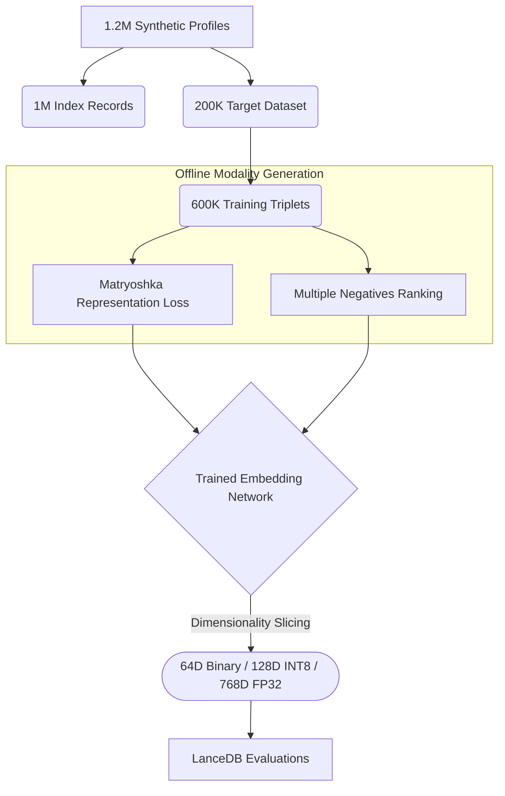
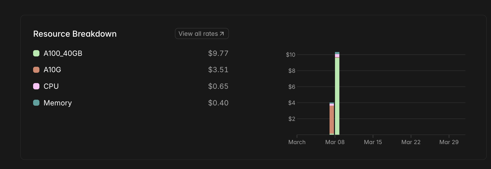
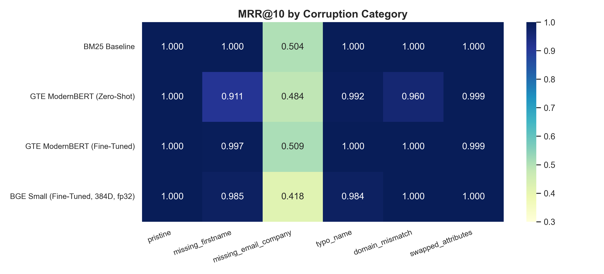
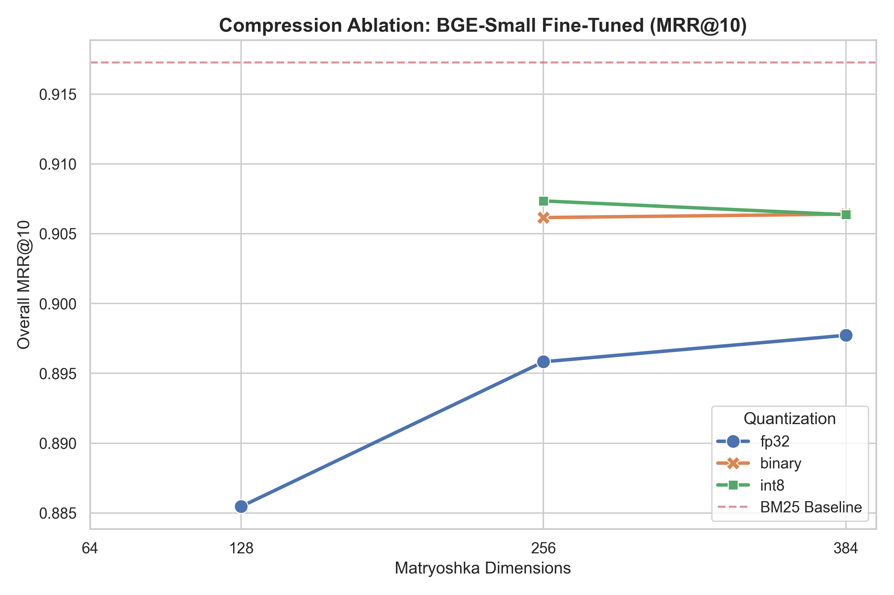
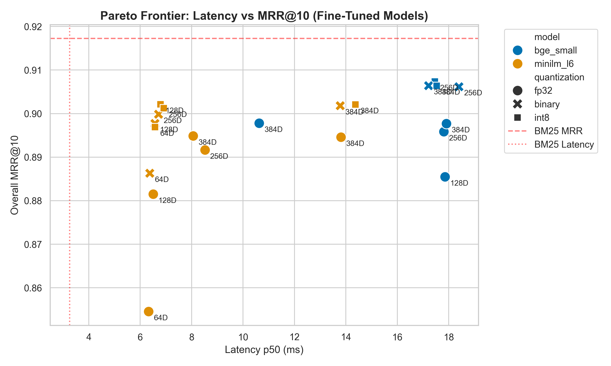
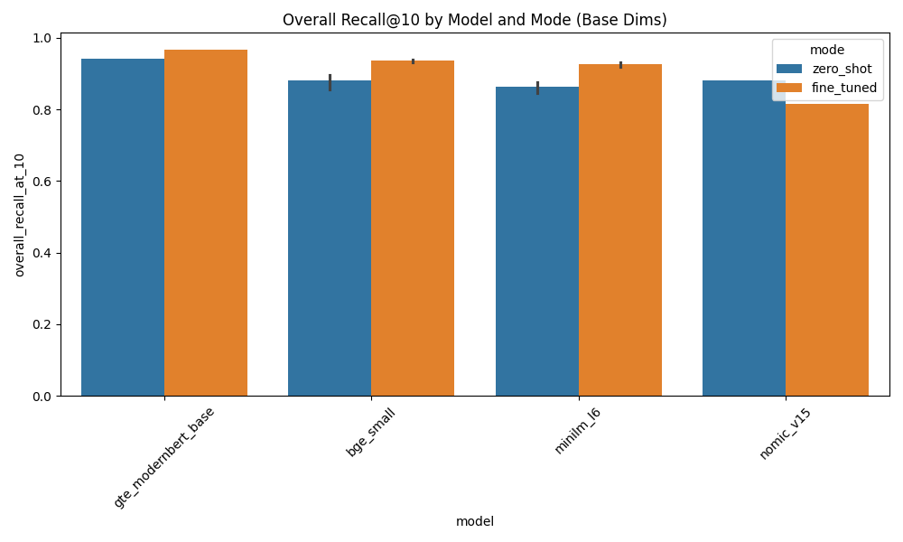

## Introduction

If you've ever tried to scale exact-match search to 500 million rows, you know BM25 breaks down when users type abbreviations, typos, or miss fields entirely. The obvious fix is dense retrieval. But there is a catch: loading 500M standard 768-dimensional FP32 vectors demands over 1.5TB of RAM. That is a non-starter for most production architectures.

Entity resolution—the task of consistently identifying real-world people across massive databases—is a fundamental retrieval challenge. The standard approach relies heavily on lexical algorithms like BM25 via [Elasticsearch](https://www.elastic.co/). While Elasticsearch offers tools like fuzziness to combat typos, applying fuzzy matching across a 500 million row B2B contact database introduces high query latency and cascades false positives. Practically, engineers depend heavily on strict lexical evaluation on constrained schemas, where searching for an abbreviated "Jon" entirely misses the canonical "Jonathan", and searching using a personal Gmail drops the corporate record containing a strict work domain.

A continuous dense representation naturally solves this by mapping records into a shared semantic space, overcoming rigid lexical barriers smoothly. But deploying a true dense retrieval fallback pipeline imposes a strict memory requirement.

In this article, we evaluate whether compact dense embedding models (under 150M parameters) fine-tuned via [Matryoshka Representation Learning](https://arxiv.org/abs/2205.13147) (MRL) can dynamically outperform pure BM25 baselines on targeted corruptions (abbreviations, field drops, and domain swaps), while surviving aggressive, scale-friendly quantizations.

To accomplish this, we structured an end-to-end evaluation using efficient serverless infrastructure—fine-tuning five parallel model architectures for under $15 total compute on [Modal](https://modal.com/). We built a 1.2 million record synthetic dataset spanning names, organizations, and global domains, constructed 600K training triplets simulating production decay scenarios, and executed a comprehensive ablation study across [LanceDB](https://lancedb.com/) evaluating models, dimensions, and quantization formats.

## The Approach: Synthetic Data and Matryoshka Learning

To test without touching production PII, we generated synthetic B2B contact profiles containing names, companies, emails, and countries. 

We structured the profiles into a minimal positional string format before encoding. A clean `pristine` profile looks like this:
`Jonathan Smith | Google Inc | jonathan.smith@google.com | USA`

During training and evaluation, we generated severe data variations based on six strict rules. Below are three actual examples from the resulting data triplet pipeline indicating how the dataset was structured organically:

| Anchor Input (Query) | Positive Target (True Match) | Negative Sample (Curriculum) | Error Type |
|:---|:---|:---|:---|
| Britzayn \| Johnson \| Robinson PLC \| brittany.johnson@protonmail.com \| USA | Brittany \| Johnson \| Robinson PLC \| brittany.johnson@protonmail.com \| USA | Jocelyn \| Gibson \| Robinson-Ballard \| jgibson@robinson-ballard.com \| USA | Typo Name + Same Prefix |
| Paige \| Freeman \| Johnson, Jones and Welch \| paige.freeman@outlook.com \| Brazil | P. \| Freeman \| Johnson, Jones and Welch \| paige.freeman@outlook.com \| Brazil | | Abbreviated Name |
| Adriana \|  \| Brown-Fry \| agutierrez@brown-fry.com \| UK | Adriana \| Gutierrez \| Brown-Fry \| agutierrez@brown-fry.com \| UK | | Missing Attributes |

We tested the lexical **BM25** baseline against four dense retriever variants spanning differing capacities:
- [**all-MiniLM-L6-v2**](https://huggingface.co/sentence-transformers/all-MiniLM-L6-v2) **(22M)**: The absolute parameter floor.
- [**bge-small-en-v1.5**](https://huggingface.co/BAAI/bge-small-en-v1.5) **(33M)**: The efficiency baseline.
- [**nomic-embed-text-v1.5**](https://huggingface.co/nomic-ai/nomic-embed-text-v1.5) **(137M)**: A modern model natively trained with prefix instructions.
- [**gte-modernbert-base**](https://huggingface.co/Alibaba-NLP/gte-modernbert-base) **(149M)**: A Flash-Attention enabled backbone with native scaling.

We fine-tuned the dense models using a generated triplets dataset comprising an anchor, a positive canonical match, and hard negative samples drawn dynamically via structural curriculum learning. 

To solve the 1.5TB memory problem organically, we optimized the output embeddings wrapped inside **MatryoshkaLoss** to calculate gradients concurrently across dimensional segments of `[768, 512, 256, 128, 64]`. 

We ran parallel fine-tuning pipelines using [Modal](https://modal.com/) on A10G GPUs. Spinning up robust distributed remote infrastructure is a must when running sweeping ablations like this. Fine-tuning all five pipelines concurrently took exactly 60 minutes and cost **less than $15 in total compute.**

*Figure: The Modal billing dashboard demonstrating the $14.50 cost for training all constraints simultaneously.*

## Evaluating Accuracy Across Degradations

We measured both Recall@10 (the proportion of queries where the canonical record appears in the top 10 results) and Mean Reciprocal Rank (MRR@10). While BM25 provides an incredibly strong baseline on exact lexical overlaps, the core of our evaluation focuses on the behavior of these models when the signal text is heavily degraded.

*Figure 1: Model performance (Overall MRR@10) across the six corruption buckets.*

### 1. GTE-ModernBERT Dominates Heavily Corrupted Queries

BM25 yields perfect recall on pristine queries, but its performance strongly correlates with token similarity, leading to significant drops when attributes are removed. 

When the profile omits the email and company entirely, BM25 Recall@10 drops to 0.750. This is where the **fine-tuned GTE-ModernBERT (149M)** excels, driving the Recall to 0.798 (a +4.8pp jump) while simultaneously returning near-perfect exact matching across cleanly formed buckets. 

Overall, the customized GTE-ModernBERT delivers an 0.966 global Recall@10, beating the 0.958 baseline set by BM25. Interestingly, its global MRR@10 (0.917) exactly matches BM25, proving it retrieves the right semantic candidates into the top slot as reliably as a rigid string match.

*Figure 2: Global MRR@10 metrics across all distinct models. Notice the vast gap between base and fine-tuned configurations for the smaller models.*

### 2. Catastrophic Forgetting in Rigid Architectures

Fine-tuning the 137M parameter `nomic-v1.5` architecture presented a unique catastrophic forgetting challenge. 

Nomic-v1.5 natively relies on rigid instruction prefixes (like `search_query: `) positioned structurally to route queries and documents into distinct vector endpoints. When we subjected it to standard MNRL targeting short structured strings, the optimizer shattered the foundational representations. The base model outright collapsed handling partial queries, dropping from 48.8% Recall@10 down to 15.2%. Its MRR@10 dropped from 0.850 (zero-shot) to 0.795 post fine-tuning.

### Table 1: Base Architecture Capabilities (FP32/None, Maximum Dimensions)

Here are the uncompressed Maximum-Dimensional configurations (e.g. 768D FP32) tracking zero-shot performance directly against fine-tuned model adaptations. 

| Model | Mode | Dims | FP32 (MRR \| Size) | INT8 (MRR \| Size) | Binary (MRR \| Size) |
|-------|------|------|--------------------|--------------------|----------------------|
| `bge_small` | Zero-Shot | 384 | 0.844 \| 1616.8MB | 0.875 \| 1726.2MB | 0.868 \| 1680.4MB |
| `minilm_l6` | Zero-Shot | 384 | 0.840 \| 1616.8MB | 0.856 \| 1726.2MB | 0.852 \| 1680.4MB |
| `gte_modernbert` | Zero-Shot | 768 | 0.891 \| 3105.3MB | - | - |
| `nomic_v15` | Zero-Shot | 768 | 0.850 \| 3105.3MB | - | - |
| `bge_small` | Fine-Tuned | 384 | 0.898 \| 1616.8MB | 0.906 \| 1726.2MB | 0.906 \| 1680.4MB |
| `minilm_l6` | Fine-Tuned | 384 | 0.895 \| 1616.8MB | 0.902 \| 1726.2MB | 0.902 \| 1680.4MB |
| `gte_modernbert` | Fine-Tuned | 768 | 0.917 \| 3105.3MB | - | - |
| `nomic_v15` | Fine-Tuned | 768 | 0.795 \| 3104.9MB | - | - |

The smaller models benefit massively from the domain adaptation. `bge_small` jumps from 0.844 to 0.898 MRR, and `minilm_l6` climbs from 0.840 to 0.895. 

## Solving System Pragmatics: Compression and Index Scaling

Dense vectors carry strict search overhead. BM25 yields p50 latencies around 3.25ms against the 1M record dataset. The primary victor (GTE-ModernBERT) averages 24.12ms p50 latency and requires over 3.1GB per million records.

To compress index footprint, we scaled the representations down directly at index time using our Matryoshka training. By querying LanceDB mathematically truncated and quantized, we avoided re-running the heavy neural encoding for the ablation.

*Figure 3: Ablation tracking dimensionality versus MRR@10 using BGE-Small.*

Using BGE-Small and MiniLM, we saw binary embeddings collapse below 128 dimensions. But INT8 models held steady, matching the performance of their wider counterparts.

### The Pareto Victor: MiniLM-L6 at 128D (INT8)

At inference time, accuracy is only one axis of the problem. Latency and memory load govern operational limits.

*Figure 4: The latency-MRR Pareto frontier for fine-tuned dense retrievers vs. BM25.*

We observed that **fine-tuned MiniLM-L6 mapped to a 128-INT8 configuration** returned results in 6.79ms (p50) and compressed the index to under 700MB. 

Despite extreme volume compression, it holds a resilient 0.934 Recall@10 globally. This condenses the required 500M scale index from 1.5TB down to roughly 350GB, moving it firmly into operational viability.

*Figure 5: Overall Recall@10 by Model and Mode. Fine-tuning pushes the tiny 22M parameter MiniLM-L6 (0.928) perilously close to the zero-shot baseline of the 149M ModernBERT (0.941).*

## Code & Operational Architecture

Entity resolution on real-world data requires models that are robust to missing or inherently noisy attribute fields. While dense retrieval models elegantly solve the lexical mismatch problem, their infrastructure footprint is often prohibitive at production scales.

By structuring a curriculum of realistic corruptions and applying Matryoshka learning paired with integer quantization, we compressed the needed memory strictly. The fine-tuned MiniLM-L6 model mapped to 128D (INT8) hit the 'Goldilocks' zone as it drastically reduced the index size while retaining speed. We shrunk the required index capability by over ~78%, pushed latency comfortably beneath the 7ms bound, and successfully maintained high Recall metrics on degraded queries. 

Next time you hit a problem where text matches fail but semantic size is too heavy, consider fine-tuning a small model and deriving quantized outputs from a Matryoshka manifold. 

These resulting fine-tuned checkpoints are public on HuggingFace:
- [`jayshah5696/er-gte-modernbert-base-pipe-ft`](https://huggingface.co/jayshah5696/er-gte-modernbert-base-pipe-ft)
- [`jayshah5696/er-bge-small-pipe-ft`](https://huggingface.co/jayshah5696/er-bge-small-pipe-ft)
- [`jayshah5696/er-minilm-l6-pipe-ft`](https://huggingface.co/jayshah5696/er-minilm-l6-pipe-ft)

For the full detailed ablation pipeline, including the direct LanceDB configurations—check out the [`entity-resolution-poc`](https://github.com/jayshah5696/entity-resolution-poc) source tree on our GitHub.
## Appendix: Comprehensive Ablation Grids

The following tables present the full ablation results for Matryoshka dimensions against quantization levels, grouping the key metrics side-by-side to allow for direct evaluation of compression tradeoffs.

### Model: `bge_small` (Fine-Tuned)
| Dimensions | FP32 (MRR \| R@10 \| Size) | INT8 (MRR \| R@10 \| Size) | Binary (MRR \| R@10 \| Size) |
|---|---|---|---|
| 384D | 0.898 \| 0.932 \| 1616.8MB | 0.906 \| 0.941 \| 1726.2MB | 0.906 \| 0.940 \| 1680.4MB |
| 256D | 0.896 \| 0.930 \| 1161.3MB | **0.907** 🏆 \| **0.942** \| 1207.1MB | 0.906 \| 0.942 \| 1176.6MB |
| 128D | 0.885 \| 0.921 \| 665.2MB | - | - |

### Model: `minilm_l6` (Fine-Tuned)
| Dimensions | FP32 (MRR \| R@10 \| Size) | INT8 (MRR \| R@10 \| Size) | Binary (MRR \| R@10 \| Size) |
|---|---|---|---|
| 384D | 0.895 \| 0.928 \| 1616.8MB | 0.902 \| 0.935 \| 1726.2MB | 0.902 \| 0.934 \| 1680.4MB |
| 256D | 0.892 \| 0.925 \| 1161.3MB | 0.901 \| 0.933 \| 1207.1MB | 0.900 \| 0.933 \| 1176.6MB |
| 128D | 0.881 \| 0.916 \| 665.2MB | **0.902** 🏆 \| **0.934** \| 688.0MB | 0.898 \| 0.931 \| 672.8MB |
| 64D | 0.855 \| 0.890 \| *417.1MB* ⚡ | 0.897 \| 0.929 \| *428.5MB* ⚡ | 0.886 \| 0.920 \| *420.9MB* ⚡ |

*(Note: BM25 Baseline achieved **0.917** MRR@10 with a **143.7MB** index).*

