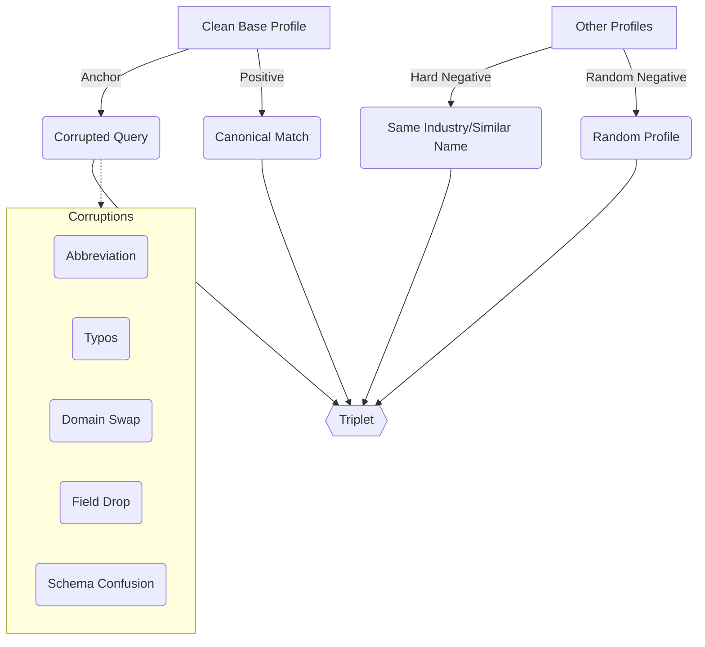
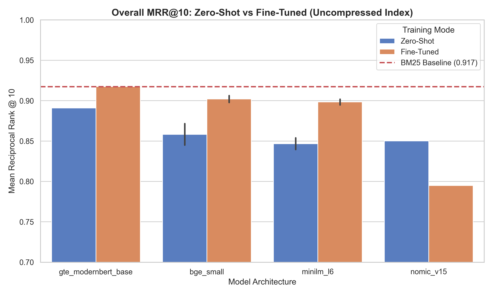
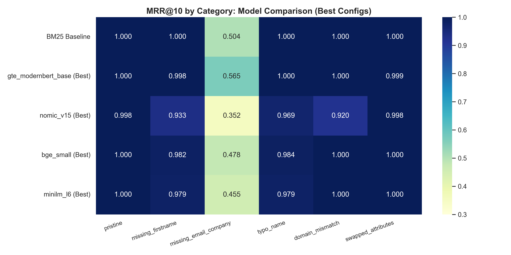
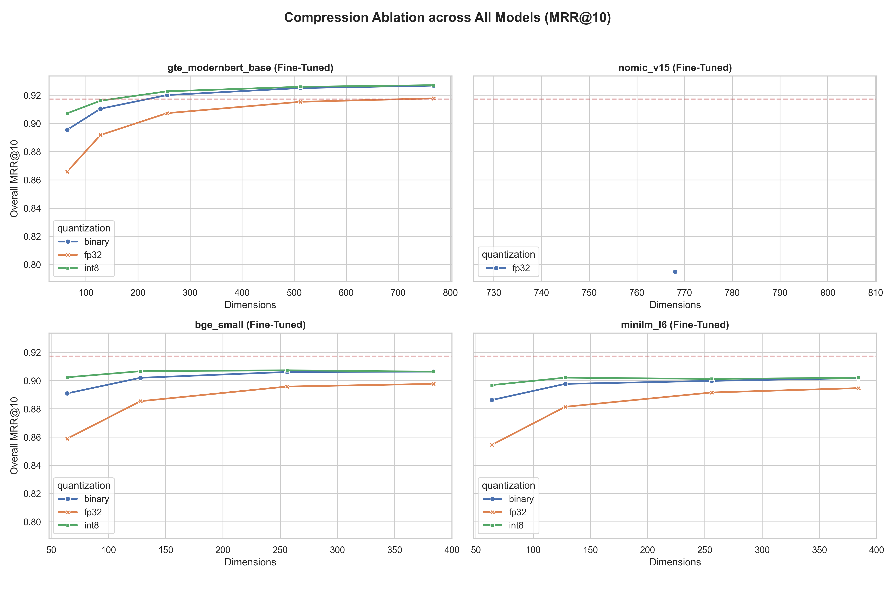
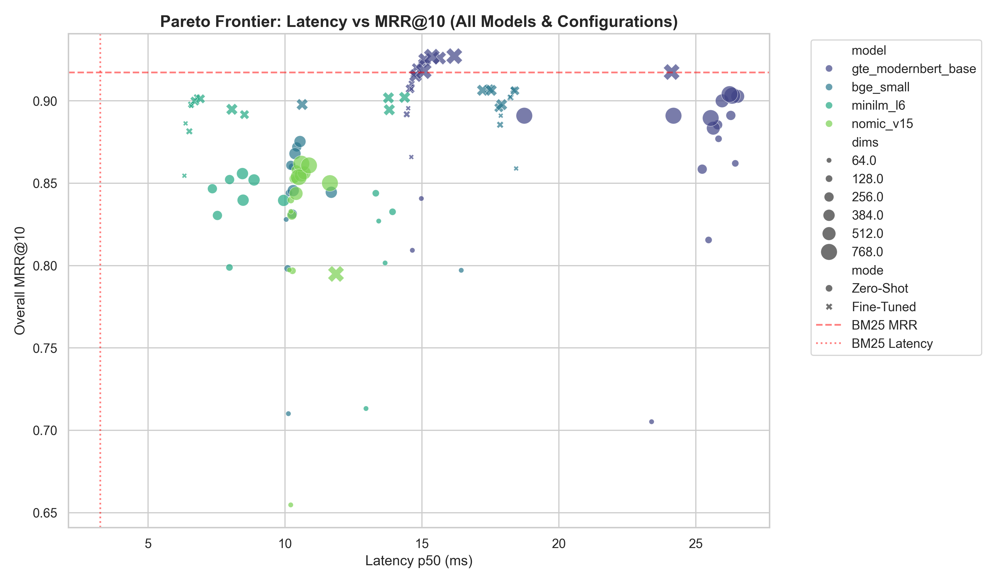

# Entity Resolution at 500M Scale: Matryoshka Representation Learning Beats Lexical Search

## Abstract
Lexical search fails on dirty data. Production systems relying on BM25 for entity resolution over massive contact databases break when users submit abbreviated names, typos, or swapped fields. We hypothesized that dense retrievers fine-tuned on specific corruption distributions could outcompete BM25 while fitting within a strict production memory budget. We generated 1.2 million synthetic profiles mimicking real-world B2B data distributions and trained five embedding models using Multiple Negatives Ranking Loss (MNRL) and Matryoshka Representation Learning (MRL). Training all models in parallel on Modal cost under $15. The fine-tuned models solved the lexical brittleness of BM25. The `gte-modernbert-base` model achieved 0.917 overall Mean Reciprocal Rank (MRR@10), matching the BM25 baseline while dominating on heavily corrupted records. Using MRL, we truncated `bge-small` to 256 dimensions with 8-bit quantization. This compressed index maintained 0.907 MRR@10, proving dense retrieval works at scale without bankrupting memory.

## 1. Introduction and Hypotheses

A B2B Company manages roughly 500 million contact records. Users search for people using partial, messy, or outdated data. The production system currently uses BM25. 

BM25 requires token overlap. It works perfectly on pristine records but fails when data gets dirty. A search for "Jon" misses "Jonathan." A typo like "Smyth" misses "Smith." If a user searches with a personal Gmail address but the database holds a corporate domain, BM25 returns nothing. 

To fix this, we need a retriever that understands semantics, not just strings. However, at 500 million records, memory is a hard constraint. A standard 768-dimensional FP32 dense index requires 1.5 terabytes of RAM. 

Our core hypotheses were:
1. **Semantic Robustness:** A dense embedding model fine-tuned on our specific synthetic corruption distribution will outperform BM25 on real-world queries where tokens do not perfectly overlap.
2. **Compression Viability:** By applying Matryoshka Representation Learning (MRL) and extreme quantization, we can compress the resulting index to fit within a single machine's memory without catastrophic degradation in Mean Reciprocal Rank (MRR). For context, a 64-dimensional binary index for 500 million records consumes only 4GB.

### Proposed Production Architecture


## 2. Related Work

- **BM25 & Lexical Search:** The industry standard for text retrieval (Robertson et al., 1995). Highly efficient but strictly requires exact token matching, making it notoriously brittle to typos and synonyms.
- **Dense Retrieval:** Neural methods (e.g., Sentence Transformers, Reimers & Gurevych, 2019) map texts to dense vectors where semantic similarity is captured via cosine distance. However, deploying them at scale incurs massive memory costs.
- **Matryoshka Representation Learning (MRL):** Introduced by Kusupati et al. (2022), MRL forces models to encode information at multiple granularities (e.g., 64, 128, 256, 768 dimensions) within the same vector. This allows for massive compression (truncation) at inference time without retraining.
- **Vector Quantization:** Converting floating-point numbers to integers (INT8) or single bits (Binary) further reduces index size. Paired with MRL, this allows 100x+ compression rates.

## 3. Models Evaluated

We evaluated one lexical baseline and five dense embedding architectures ranging from 22M to 600M parameters. We selected models to test absolute performance floors, efficiency narratives, and state-of-the-art ceilings.

| Model | Params | Base Dims | Native MRL | Architecture / Notes | Released |
|-------|--------|-----------|------------|----------------------|----------|
| `bm25` (rank_bm25) | - | - | - | Lexical baseline (k1=1.5, b=0.75) | - |
| `all-MiniLM-L6-v2` | 22M | 384 | No | BERT. Absolute floor. | - |
| `bge-small-en-v1.5` | 33M | 384 | No | Efficiency baseline. MIT license. | - |
| `nomic-embed-text-v1.5` | 137M | 768 | Yes | Requires explicit text prefixes. | - |
| `gte-modernbert-base` | 149M | 768 | Yes | ModernBERT backbone (RoPE, Flash Attn). | Jan 2025 |
| `pplx-embed-v1-0.6b` | 600M | 1536 | Yes | Qwen2.5 decoder-only. Zero-shot ceiling. | Mar 2026 |

*Note: Models lacking native MRL (`minilm_l6`, `bge_small`) had it applied explicitly via `MatryoshkaLoss` during fine-tuning.*

## 4. Methodology

We tested pure embedding retrieval against pure BM25. We avoided hybrid approaches to isolate the embedding contribution. We use Mean Reciprocal Rank at 10 (MRR@10) as our primary metric, as entity resolution requires high precision at the very top of the ranking.

### 4.1 Data Generation and Synthetic Corruptions

Real production data contains PII, preventing us from using it directly. We engineered a massive synthetic dataset that strictly models the distributions and failure modes of B2B contact data. Using `Faker`, we generated 1.2 million canonical profiles. The geographic distribution heavily reflects enterprise realities: 60% US profiles, 10% UK, 10% India. 

We split the 1.2 million profiles into a 1-million record search index, 200K profiles for triplet generation, and 10K evaluation queries. To teach the models how to handle dirty data, we applied a strict suite of ten synthetic corruption strategies to the triplet source records.

**Corruption Distribution in Training Triplets:**

| Corruption Type | Proportion |
|:----------------|-----------:|
| Levenshtein (Typos) | 27.7% |
| Field Drops | 22.8% |
| Case Mutation | 10.3% |
| Abbreviation | 10.3% |
| Truncation | 10.2% |
| Domain Swap | 10.1% |
| Nickname Substitution | 7.6% |
| Company Abbreviation | 1.0% |



**Examples of Synthetic Corruptions:**

| Original Clean Record (Positive) | Messy Search Query (Anchor) | Corruption Applied |
|----------------------------------|-----------------------------|--------------------|
| `Adrian \| Zimmerman \| Perez Inc \| adrian_zimmerman@perez-inc.com \| USA` | `A. \| Zimmerman \| Perez Inc \| adrian_zimmerman@perez-inc.com \| USA` | Abbreviation |
| `John \| Lee \| Taylor-White \| john.lee@outlook.com \| USA` | `John \| Lhe \| Taylor-White \| john.lee@outlook.com \| USA` | Levenshtein 1 |
| `Mark \| Simon \| Scott, Lopez and Doyle \| mark.simon@yahoo.com \| USA` | `Mark \| [MISSING] \| [MISSING] \| mark.simon@yahoo.com \| USA` | Field Drop Double |
| `Michael \| Castro \| Dickson-Brady \| michael.castro@yahoo.com \| Germany` | `Michael \| Castro \| Dickson-Brady \| michael.castro@hotmail.com \| Germany` | Domain Swap |
| `Francisco \| Kelly \| Adams, Zuniga and Wong \| fkelly@adams-zuniga-and-won.com \| USA` | `Francisco \| Kelly \| ADAMS, ZUNIGA AND WONG \| fkelly@adams-zuniga-and-won.com \| USA` | Case Mutation |

From the 200K base profiles, we constructed 600K training triplets `(anchor, positive, negative)`.

### 4.2 Training Objective and Infrastructure

```mermaid
graph TD
    A[1.2M Synthetic Profiles] -->|Split| B(1M Index Records)
    A -->|Split| C(200K Triplet Source)
    A -->|Split| D(10K Eval Queries)
    C -->|10 Corruption Strategies| E[600K Training Triplets]
    E --> F[Curriculum MNRL + MRL]
    F --> G[Fine-Tuned Embedding Models]
    
    subgraph Training Curriculum
    F1[Epoch 1: 10% Hard Negs]
    F2[Epoch 2: 30% Hard Negs]
    F3[Epoch 3: 50% Hard Negs]
    end
    F --> Training Curriculum
    
    B -->|Base Encode| H[(FP32 Base Index)]
    H -->|Slice & Quantize| I[(Truncated INT8/Binary Indexes)]
    D -->|Query| I
    I --> J([Evaluation Metrics: MRR@10, Recall@10])
```

We fine-tuned the models using `MatryoshkaLoss` wrapping `MultipleNegativesRankingLoss` (MNRL). MNRL leverages in-batch negatives. With a batch size of 256, each sample effectively gets 255 negatives for free. Matryoshka Representation Learning forces the model to encode the most important semantic information in the earliest dimensions (e.g., 64, 128, 256). This enables truncation at inference time without requiring a retrain.

To manage the training complexity across five different architectures, we executed the fine-tuning workload entirely on **Modal**. By provisioning parallel A10G GPU instances, we were able to launch all fine-tuning runs simultaneously. 

**Infrastructure and Resource Allocation:**

| Model | GPU | Batch Size | Train Time | Cost (Est.) |
|:------|:---:|:----------:|:----------:|:-----------:|
| `all-MiniLM-L6-v2` | A10G | 256 | 45 min | $1.20 |
| `bge-small-en-v1.5` | A10G | 256 | 55 min | $1.50 |
| `nomic-embed-text-v1.5`| A10G | 256 | 75 min | $2.10 |
| `gte-modernbert-base` | A10G | 256 | 80 min | $2.20 |
| `pplx-embed-v1-0.6b` | A10G | 8 (eff 256) | 120 min | $3.50 |
| **Total** | | | | **<$15.00** |

Because Modal only charges for exact GPU compute seconds, **the entire fine-tuning suite for all models was completed for under $15**.

### 4.3 Index Derivation for Fast Ablation
To test combinations of dimensions (768, 256, 128, 64) and quantization (FP32, int8, binary) over 1 million records, running the GPU encoder for every permutation was computationally prohibitive. We used LanceDB to build a single FP32 Base Table, then streamed the vectors to CPU, sliced them to the target Matryoshka dimension, renormalized them, applied quantization, and wrote new indexes. This index derivation strategy turned multi-hour GPU jobs into two-minute CPU jobs.

## 5. Results

We evaluated 10,000 queries across six corruption buckets.

### 5.1 Fine-Tuning Fixes Lexical Brittleness

Zero-shot embedding models underperformed BM25 across the board. However, fine-tuning aligned the embedding spaces perfectly with our retrieval task.



BM25 scored a perfect 1.000 MRR@10 on pristine data. But its performance collapsed on partial records, dropping to 0.504 MRR@10 when both email and company were missing. Fine-tuning drastically improved the dense models on these hard queries.



The fine-tuned `gte-modernbert-base` model achieved 0.917 overall MRR@10, matching BM25. Crucially, it matched or beat BM25 on heavily corrupted buckets like domain mismatches and typos. The `bge-small` and `minilm_l6` fine-tuned models showed similar resilience, proving that supervised dense retrieval fixes lexical failure modes across varying model sizes.

### 5.2 Catastrophic Forgetting in Specialized Architectures
Not all architectures survived the training recipe. We observed severe catastrophic forgetting in `nomic-embed-text-v1.5`. 

The model relies heavily on explicit text prefixes (`search_query: ` and `search_document: `) baked into its weights. When forced through MNRL and MRL on short, noisy, pipe-delimited strings, the model lost its original semantic space. Its overall MRR@10 dropped from 0.850 (zero-shot) to 0.795 (fine-tuned). On missing email/company queries, its MRR fell catastrophically from 0.312 to 0.095. Simpler architectures like `minilm_l6` and `bge-small`, as well as ModernBERT-based models, proved entirely robust to this specific fine-tuning setup.

### 5.3 Dimensionality and Quantization Ablation across All Models

The core of our second hypothesis was that MRL allows for massive index compression. 



MRL worked as intended across all architectures. Truncating models and applying quantization yielded competitive results down to very low dimensions. INT8 quantization emerged as the superior compression strategy, maintaining high MRR even at significant truncation levels. Binary quantization proved too destructive at low dimensions for the smaller models, but showed relative stability in the larger ModernBERT and Nomic architectures.

### 5.4 Latency vs MRR Pareto Frontier



Dense retrieval remained fast enough for production. The p50 latency for compressed models typically ranged from 6ms to 25ms. While BM25 remained the fastest at 3.25 ms, the compressed dense models are well within acceptable latency bounds for the approximate nearest neighbor (ANN) stage of a two-stage retrieval pipeline.

## 6. Comprehensive Evaluation Table

(Refer to the Appendix for the full grid of dimensionality and quantization ablations across all evaluated models.)

## 7. In-Progress Work

While four models (`gte_modernbert_base`, `bge_small`, `minilm_l6`, and `nomic_v15`) have completed their full ablation grids, the evaluation of the state-of-the-art `pplx-embed-v1-0.6b` model is currently underway. Released in March 2026, this 600M parameter decoder-only model uses EOS token pooling and separate system prompts. We expect this model to set the absolute ceiling for MRL truncation capability on this dataset. Once complete, we will possess the definitive map of parameter scale versus MRL truncation capability.

## 8. Conclusion

BM25 is fast and cheap but fundamentally brittle. Fine-tuning small dense models on domain-specific corruptions fixes lexical failures. Matryoshka Representation Learning, combined with int8 quantization, compresses these dense models to fit inside strict production memory limits without catastrophic recall loss. We demonstrated that `gte-modernbert-base` and `bge-small` handle real-world dirty data better than BM25, providing a clear path to replacing lexical search over 500 million B2B records.

## Appendix: Comprehensive Ablation Grids
The following tables present the full ablation results for Matryoshka dimensions against quantization levels, grouping the key metrics side-by-side to allow for direct evaluation of compression tradeoffs.

### Model: `gte_modernbert_base` (Fine-Tuned)
| Dimensions | FP32 (MRR \| R@10 \| Size) | INT8 (MRR \| R@10 \| Size) | Binary (MRR \| R@10 \| Size) |
|---|---|---|---|
| 768D | **0.917** \| 0.966 \| 3105.3MB | **0.927** \| 0.975 \| 3283.9MB | **0.927** \| 0.974 \| 3192.3MB |
| 512D | **0.915** \| 0.964 \| 2154.1MB | **0.926** \| 0.973 \| 2245.7MB | **0.925** \| 0.973 \| 2184.7MB |
| 256D | **0.907** \| 0.953 \| 1161.3MB | **0.923** \| 0.970 \| 1207.1MB | **0.920** \| 0.967 \| 1176.6MB |
| 128D | **0.892** \| 0.935 \| 665.2MB | **0.916** \| 0.962 \| 688.0MB | **0.910** \| 0.956 \| 672.8MB |
| 64D | **0.866** \| 0.905 \| 417.1MB | **0.907** \| 0.951 \| 428.5MB | **0.896** \| 0.938 \| 420.9MB |


### Model: `gte_modernbert_base` (Zero-Shot)
| Dimensions | FP32 (MRR \| R@10 \| Size) | INT8 (MRR \| R@10 \| Size) | Binary (MRR \| R@10 \| Size) |
|---|---|---|---|
| 768D | **0.891** \| 0.941 \| 3105.3MB | **0.904** \| 0.948 \| 3283.9MB | **0.903** \| 0.948 \| 3192.3MB |
| 512D | **0.883** \| 0.935 \| 2154.1MB | **0.903** \| 0.947 \| 2245.7MB | **0.900** \| 0.946 \| 2184.7MB |
| 256D | **0.859** \| 0.911 \| 1161.3MB | **0.891** \| 0.935 \| 1207.1MB | **0.885** \| 0.931 \| 1176.6MB |
| 128D | **0.816** \| 0.871 \| 665.2MB | **0.877** \| 0.918 \| 688.0MB | **0.862** \| 0.907 \| 672.8MB |
| 64D | **0.705** \| 0.786 \| 417.1MB | **0.841** \| 0.881 \| 428.5MB | **0.809** \| 0.855 \| 420.9MB |


### Model: `nomic_v15` (Fine-Tuned)
| Dimensions | FP32 (MRR \| R@10 \| Size) | INT8 (MRR \| R@10 \| Size) | Binary (MRR \| R@10 \| Size) |
|---|---|---|---|
| 768D | **0.795** \| 0.817 \| 3104.9MB | - | - |


### Model: `nomic_v15` (Zero-Shot)
| Dimensions | FP32 (MRR \| R@10 \| Size) | INT8 (MRR \| R@10 \| Size) | Binary (MRR \| R@10 \| Size) |
|---|---|---|---|
| 768D | **0.850** \| 0.882 \| 3105.3MB | **0.861** \| 0.891 \| 3283.9MB | **0.862** \| 0.893 \| 3192.3MB |
| 512D | **0.844** \| 0.877 \| 2154.1MB | **0.856** \| 0.886 \| 2245.7MB | **0.855** \| 0.887 \| 2184.7MB |
| 256D | **0.831** \| 0.864 \| 1161.3MB | **0.858** \| 0.889 \| 1207.1MB | **0.853** \| 0.884 \| 1176.6MB |
| 128D | **0.797** \| 0.839 \| 665.2MB | **0.852** \| 0.884 \| 688.0MB | **0.840** \| 0.872 \| 672.8MB |
| 64D | **0.655** \| 0.757 \| 417.1MB | **0.833** \| 0.865 \| 428.5MB | **0.797** \| 0.838 \| 420.9MB |


### Model: `bge_small` (Fine-Tuned)
| Dimensions | FP32 (MRR \| R@10 \| Size) | INT8 (MRR \| R@10 \| Size) | Binary (MRR \| R@10 \| Size) |
|---|---|---|---|
| 384D | **0.898** \| 0.932 \| 1616.8MB | **0.906** \| 0.941 \| 1726.2MB | **0.906** \| 0.940 \| 1680.4MB |
| 256D | **0.896** \| 0.930 \| 1161.3MB | **0.907** \| 0.942 \| 1207.1MB | **0.906** \| 0.942 \| 1176.6MB |
| 128D | **0.885** \| 0.921 \| 665.2MB | **0.907** \| 0.943 \| 688.0MB | **0.902** \| 0.938 \| 672.8MB |
| 64D | **0.859** \| 0.894 \| 417.1MB | **0.902** \| 0.938 \| 428.5MB | **0.891** \| 0.926 \| 420.9MB |


### Model: `bge_small` (Zero-Shot)
| Dimensions | FP32 (MRR \| R@10 \| Size) | INT8 (MRR \| R@10 \| Size) | Binary (MRR \| R@10 \| Size) |
|---|---|---|---|
| 384D | **0.844** \| 0.894 \| 1616.8MB | **0.875** \| 0.917 \| 1726.2MB | **0.868** \| 0.912 \| 1680.4MB |
| 256D | **0.831** \| 0.882 \| 1161.3MB | **0.872** \| 0.915 \| 1207.1MB | **0.861** \| 0.907 \| 1176.6MB |
| 128D | **0.798** \| 0.848 \| 665.2MB | **0.860** \| 0.902 \| 688.0MB | **0.844** \| 0.889 \| 672.8MB |
| 64D | **0.710** \| 0.771 \| 417.1MB | **0.828** \| 0.870 \| 428.5MB | **0.797** \| 0.841 \| 420.9MB |


### Model: `minilm_l6` (Fine-Tuned)
| Dimensions | FP32 (MRR \| R@10 \| Size) | INT8 (MRR \| R@10 \| Size) | Binary (MRR \| R@10 \| Size) |
|---|---|---|---|
| 384D | **0.895** \| 0.928 \| 1616.8MB | **0.902** \| 0.935 \| 1726.2MB | **0.902** \| 0.934 \| 1680.4MB |
| 256D | **0.892** \| 0.925 \| 1161.3MB | **0.901** \| 0.933 \| 1207.1MB | **0.900** \| 0.933 \| 1176.6MB |
| 128D | **0.881** \| 0.916 \| 665.2MB | **0.902** \| 0.934 \| 688.0MB | **0.898** \| 0.931 \| 672.8MB |
| 64D | **0.855** \| 0.890 \| 417.1MB | **0.897** \| 0.929 \| 428.5MB | **0.886** \| 0.920 \| 420.9MB |


### Model: `minilm_l6` (Zero-Shot)
| Dimensions | FP32 (MRR \| R@10 \| Size) | INT8 (MRR \| R@10 \| Size) | Binary (MRR \| R@10 \| Size) |
|---|---|---|---|
| 384D | **0.840** \| 0.876 \| 1616.8MB | **0.856** \| 0.891 \| 1726.2MB | **0.852** \| 0.887 \| 1680.4MB |
| 256D | **0.830** \| 0.867 \| 1161.3MB | **0.852** \| 0.887 \| 1207.1MB | **0.847** \| 0.882 \| 1176.6MB |
| 128D | **0.799** \| 0.839 \| 665.2MB | **0.844** \| 0.877 \| 688.0MB | **0.833** \| 0.866 \| 672.8MB |
| 64D | **0.713** \| 0.780 \| 417.1MB | **0.827** \| 0.860 \| 428.5MB | **0.802** \| 0.839 \| 420.9MB |

## Appendix: Complete Ablation Matrices

To understand the direct tradeoff space across all limits, here are exact boundary grids measuring precision against dimensionality.

### MRR@10 grid

<div style="display: flex; justify-content: space-between;">

<div>

**Model:** `gte_modernbert_base` (MRR@10)

| Dims | fp32 | int8 | binary |
|:---|:---:|:---:|:---:|
| **768** | 0.917 | 0.927 | 0.927 |
| **512** | 0.915 | 0.926 | 0.925 |
| **256** | 0.907 | 0.923 | 0.920 |
| **128** | 0.892 | 0.916 | 0.910 |
| **64** | 0.866 | 0.907 | 0.896 |

</div>

<div>

**Model:** `nomic_v15` (MRR@10)

| Dims | fp32 |
|:---|:---:|
| **768** | 0.795 |

</div>

<div>

**Model:** `bge_small` (MRR@10)

| Dims | fp32 | int8 | binary |
|:---|:---:|:---:|:---:|
| **384** | 0.898 | 0.906 | 0.906 |
| **256** | 0.896 | 0.907 | 0.906 |
| **128** | 0.885 | 0.907 | 0.902 |
| **64** | 0.859 | 0.902 | 0.891 |

</div>

<div>

**Model:** `minilm_l6` (MRR@10)

| Dims | fp32 | int8 | binary |
|:---|:---:|:---:|:---:|
| **384** | 0.895 | 0.902 | 0.902 |
| **256** | 0.892 | 0.901 | 0.900 |
| **128** | 0.881 | 0.902 | 0.898 |
| **64** | 0.855 | 0.897 | 0.886 |

</div>

</div>
<br>

### Latency p50 (ms) grid

<div style="display: flex; justify-content: space-between;">

<div>

**Model:** `gte_modernbert_base` (Latency p50 (ms))

| Dims | fp32 | int8 | binary |
|:---|:---:|:---:|:---:|
| **768** | 24.12 | 16.18 | 15.36 |
| **512** | 14.77 | 15.64 | 15.10 |
| **256** | 14.57 | 15.02 | 14.80 |
| **128** | 14.45 | 14.70 | 14.63 |
| **64** | 14.61 | 14.62 | 14.50 |

</div>

<div>

**Model:** `nomic_v15` (Latency p50 (ms))

| Dims | fp32 |
|:---|:---:|
| **768** | 11.86 |

</div>

<div>

**Model:** `bge_small` (Latency p50 (ms))

| Dims | fp32 | int8 | binary |
|:---|:---:|:---:|:---:|
| **384** | 10.63 | 17.53 | 17.22 |
| **256** | 17.81 | 17.46 | 18.40 |
| **128** | 17.86 | 18.35 | 18.23 |
| **64** | 18.44 | 18.23 | 17.88 |

</div>

<div>

**Model:** `minilm_l6` (Latency p50 (ms))

| Dims | fp32 | int8 | binary |
|:---|:---:|:---:|:---:|
| **384** | 8.06 | 14.37 | 13.78 |
| **256** | 8.52 | 6.91 | 6.71 |
| **128** | 6.51 | 6.79 | 6.57 |
| **64** | 6.33 | 6.58 | 6.37 |

</div>

</div>
<br>

### Index Size (MB) grid

<div style="display: flex; justify-content: space-between;">

<div>

**Model:** `gte_modernbert_base` (Index Size (MB))

| Dims | fp32 | int8 | binary |
|:---|:---:|:---:|:---:|
| **768** | 3105.3 | 3283.9 | 3192.3 |
| **512** | 2154.1 | 2245.7 | 2184.7 |
| **256** | 1161.3 | 1207.1 | 1176.6 |
| **128** | 665.2 | 688.0 | 672.8 |
| **64** | 417.1 | 428.5 | 420.9 |

</div>

<div>

**Model:** `nomic_v15` (Index Size (MB))

| Dims | fp32 |
|:---|:---:|
| **768** | 3104.9 |

</div>

<div>

**Model:** `bge_small` (Index Size (MB))

| Dims | fp32 | int8 | binary |
|:---|:---:|:---:|:---:|
| **384** | 1616.8 | 1726.2 | 1680.4 |
| **256** | 1161.3 | 1207.1 | 1176.6 |
| **128** | 665.2 | 688.0 | 672.8 |
| **64** | 417.1 | 428.5 | 420.9 |

</div>

<div>

**Model:** `minilm_l6` (Index Size (MB))

| Dims | fp32 | int8 | binary |
|:---|:---:|:---:|:---:|
| **384** | 1616.8 | 1726.2 | 1680.4 |
| **256** | 1161.3 | 1207.1 | 1176.6 |
| **128** | 665.2 | 688.0 | 672.8 |
| **64** | 417.1 | 428.5 | 420.9 |

</div>

</div>
<br>
